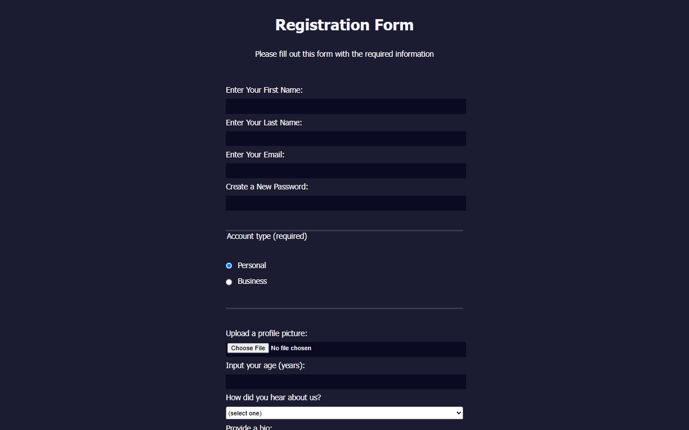

# Registration Form | FCC Responsive Web Design Certification

**Project 4/20**

A responsive registration form built with HTML and CSS, styled with a dark theme. It collects personal info, account preferences, and additional details using various form elements.

---

## 📚 Table of Contents

- [🔎 Overview](#-overview)
  - [📸 Screenshot](#-screenshot)
  - [🔗 Links](#-links)
  - [📌 Features](#-features)
- [🧠 My process](#-my-process)
  - [🛠️ Built with](#️-built-with)
  - [🔜 Next Project](#-next-project)
- [👤 Author](#-author)
  - [🌐 Connect with Me](#-connect-with-me)
  - [💻 Coding Profiles](#-coding-profiles)

---

## 🔎 Overview

### 📸 Screenshot

### 🔗 Links

 - [🔴 Live Demo](https://dalascript.github.io/registration-form/)
 - [🗂️ GitHub Repository](https://github.com/DalaScript/registration-form)

### 📌 Features

 - ✅ Pure HTML structure
 - ✅ Custom CSS styling
 - ✅ Responsive layout
 - ✅ Form validation with required

## 🧠 My Process

### 🛠️ Built with

 - HTML5
 - CSS3

### 🔜 Next Project

 - Survey Form (**Certification Project**) → [View Repository](https://github.com/DalaScript/survey-form)

---

## 👤 Author

### 🌐 Connect with Me

 - [Instagram](https://www.instagram.com/DalaScript)
 - [YouTube](https://www.youtube.com/@DalaScript)

### 💻 Coding Profiles

 - [freeCodeCamp](https://www.freecodecamp.org/DalaScript)
 - [FrontendMentor](https://www.frontendmentor.io/profile/DalaScript)
 - [GitHub](https://github.com/DalaScript)

*🙌 Thanks for checking out my project! More coming soon. Stay tuned 🚀*